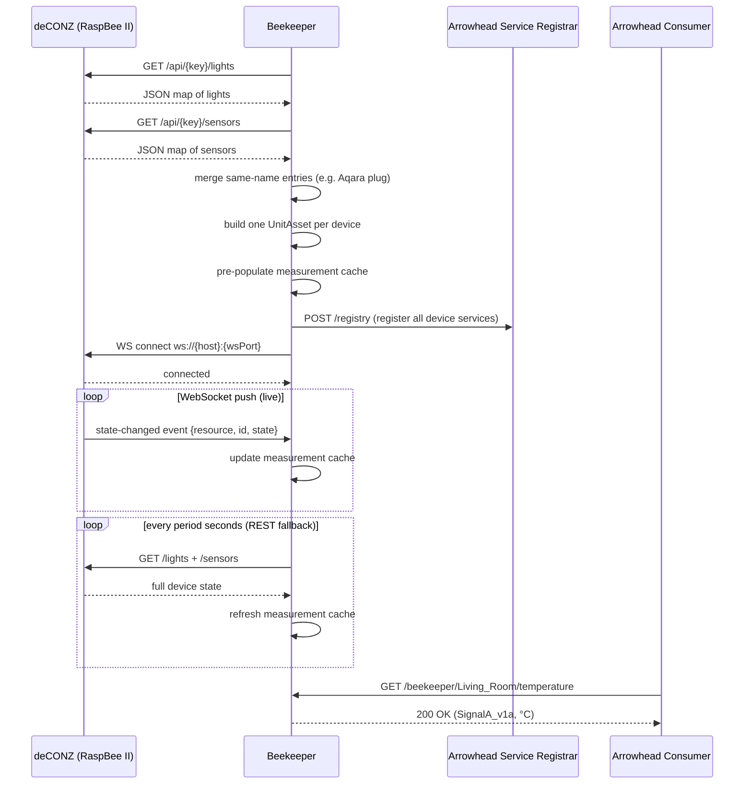

# mbaigo System: Beekeeper

The beekeeper system bridges ZigBee devices paired to a **RaspBee II** hat running **deCONZ** and an Arrowhead local cloud. It queries the deCONZ REST API at startup to discover every paired device, creates one Arrowhead unit asset per device, and keeps measurements live via the deCONZ WebSocket. A periodic REST poll runs in parallel as a fallback for events missed during reconnection gaps.

No device-specific configuration is needed. The system adapts automatically to whatever devices are paired in deCONZ.

---

## Hardware and software requirements

| Component | Details |
|---|---|
| Gateway hardware | Raspberry Pi with a RaspBee II ZigBee hat |
| Gateway software | deCONZ by dresden elektronik (runs as a service on the Pi) |
| REST API port | 80 (default) |
| WebSocket port | 443 (default) |
| API key | Obtained once from the deCONZ app or Phoscon web UI |

---

## Supported device types

Beekeeper recognises every ZigBee device that deCONZ exposes. The services created for each device depend on its deCONZ type.

### Lights and plugs (`/lights` endpoint)

| deCONZ type | Services |
|---|---|
| Extended color light | `on_off`, `brightness` |
| Color temperature light | `on_off`, `brightness` |
| Color light | `on_off`, `brightness` |
| Dimmable light | `on_off`, `brightness` |
| Dimmable plug-in unit | `on_off`, `brightness` |
| On/Off plug-in unit | `on_off` |
| Smart plug | `on_off` |

### Sensors (`/sensors` endpoint)

| deCONZ ZHA type | Service | Unit |
|---|---|---|
| ZHATemperature | `temperature` | °C |
| ZHAHumidity | `humidity` | % |
| ZHAPressure | `pressure` | hPa |
| ZHAPower | `power` | W |
| ZHAConsumption | `energy` | Wh |
| ZHASwitch | `button_event` | — (event code) |
| ZHAPresence | `presence` | — (1.0 = detected) |
| ZHAOpenClose | `open` | — (1.0 = open) |
| ZHALightLevel | `light_level` | lux |
| ZHAVibration | `vibration` | — (1.0 = detected) |

### Merging: Aqara smart plug

An Aqara smart plug appears in deCONZ as **two separate entries**: a light (`Smart plug` or `On/Off plug-in unit`) for switching, and one or more sensors (`ZHAPower`, `ZHAConsumption`) for metering. Beekeeper matches them by their shared IEEE MAC address (the first 8 octets of the `uniqueid` field) and merges them into **one unit asset** with services `on_off`, `power`, and `energy`.

If a plug asset only shows `on_off` and is missing `power`, it means deCONZ did not discover the metering cluster during pairing. See [Troubleshooting](#troubleshooting) below.

---

## Asset naming

The Arrowhead asset name is derived from the device name configured in deCONZ (or the Phoscon app). Spaces and non-alphanumeric characters are replaced with underscores. Leading and trailing spaces are trimmed.

Examples: `"Living Room"` → `Living_Room`, `"Kitchen-Light"` → `Kitchen_Light`.

The original deCONZ name is preserved as `Details["DisplayName"]` so consumers that discover the service via the orchestrator can present the friendly name.

---

## Sequence diagram



---

## Services

All services are **GET only**. A `SignalA_v1a` form is returned with `value`, `unit`, and `timestamp`.

| Service subpath | Unit | Description |
|---|---|---|
| `on_off` | — | Device on/off state (1.0 = on, 0.0 = off) |
| `brightness` | % | Brightness level 0–100% |
| `temperature` | °C | Temperature |
| `humidity` | % | Relative humidity |
| `pressure` | hPa | Atmospheric pressure |
| `power` | W | Instantaneous power consumption |
| `energy` | Wh | Cumulative energy consumption |
| `presence` | — | Motion detected (1.0 = yes, 0.0 = no) |
| `open` | — | Contact state (1.0 = open, 0.0 = closed) |
| `button_event` | — | Raw Aqara/ZHA button event code |
| `light_level` | lux | Ambient light level |
| `vibration` | — | Vibration detected (1.0 = yes, 0.0 = no) |

If a device has not reported since startup, its service returns `503 Service Unavailable`.

---

## Configuration

Edit `systemconfig.json`:

| Field | Description |
|---|---|
| `host` | IP address or hostname of the Raspberry Pi running deCONZ |
| `apiPort` | deCONZ REST API port (default: 80) |
| `wsPort` | deCONZ WebSocket port (default: 80) |
| `apiKey` | API key from the deCONZ / Phoscon web UI |
| `period` | REST fallback poll interval in seconds (default: 30) |

### Obtaining the API key

Open the Phoscon web UI at `http://<raspberry-pi-ip>/pwa`, go to **Settings → Gateway → Advanced**, and create an API key. Alternatively, use the deCONZ REST API discovery endpoint `POST /api` while the gateway is in pairing mode.

Example:

```json
{
    "name": "BeekeeperGateway",
    "traits": [{
        "host": "192.168.1.109",
        "apiPort": 80,
        "wsPort": 80,
        "apiKey": "6736D7BE8C",
        "period": 30
    }]
}
```

To confirm which ports your deCONZ instance is using, query its config endpoint from a terminal:

```bash
curl -s http://<pi-ip>/api/<api-key>/config | python3 -m json.tool | grep -i "websocket\|port"
```

Look for `"websocketport"` (plain WS) and `"websocketport_wss"` (TLS). Use the plain WS port value for `wsPort`.

---

## Troubleshooting

### Inspecting deCONZ from the terminal

The deCONZ REST API is the most reliable way to diagnose pairing and discovery issues. All commands below assume `BASE=http://<pi-ip>/api/<api-key>`.

**List all paired lights and plugs:**
```bash
curl -s $BASE/lights | python3 -m json.tool
```

**List all paired sensors:**
```bash
curl -s $BASE/sensors | python3 -m json.tool
```

**Inspect one specific sensor** (replace `18` with the sensor ID from the list above):
```bash
curl -s $BASE/sensors/18 | python3 -m json.tool
```

**Check gateway config** (ports, firmware version, ZigBee channel):
```bash
curl -s $BASE/config | python3 -m json.tool
```

### Plug shows `on_off` but no `power` service

This means deCONZ discovered the plug's on/off cluster but not its metering cluster during pairing. Beekeeper merges the two by MAC address — if the ZHAPower sensor does not exist in deCONZ, there is nothing to merge.

**Diagnosis** — check whether a ZHAPower sensor exists for the plug's MAC address:

```bash
# Find the plug's MAC (first 8 octets of uniqueid, before the first dash)
curl -s $BASE/lights | python3 -m json.tool | grep -A3 "PlugName"

# Search for a sensor with the same MAC
curl -s $BASE/sensors | python3 -m json.tool | grep "54:ef:44:..."
```

If no ZHAPower sensor appears, the metering cluster was not discovered.

**Fix** — remove the plug from deCONZ and re-pair it:

1. In the Phoscon web UI (`http://<pi-ip>/pwa`) go to **Devices → Smart Plugs**, select the plug, and delete it.
2. Put deCONZ into pairing mode (**Devices → Add new device**).
3. Power-cycle the plug (unplug, wait 5 seconds, replug). It will re-join and deCONZ will this time walk through all ZigBee clusters including the metering cluster (0x0B04).
4. Confirm both entries appeared:
   ```bash
   curl -s $BASE/sensors | python3 -m json.tool | grep -A5 "ZHAPower"
   ```
5. Restart beekeeper — it will automatically discover and merge the new sensor.

### WebSocket keeps reconnecting

If you see `deCONZ WebSocket: connect failed (unexpected EOF)` repeatedly, the `wsPort` in `systemconfig.json` is wrong. Query the correct value:

```bash
curl -s $BASE/config | python3 -m json.tool | grep websocket
```

Use the `"websocketport"` value (plain WS), not `"websocketport_wss"` (TLS).

---

## Compiling

```bash
go build -o beekeeper
```

Cross-compile for Raspberry Pi 4/5 (64-bit):

```bash
GOOS=linux GOARCH=arm64 go build -o beekeeper_rpi64
```

Run from its own directory — the system reads `systemconfig.json` locally. The beekeeper itself does not need to run on the same Pi as deCONZ; it only needs network access to the deCONZ host and port.
